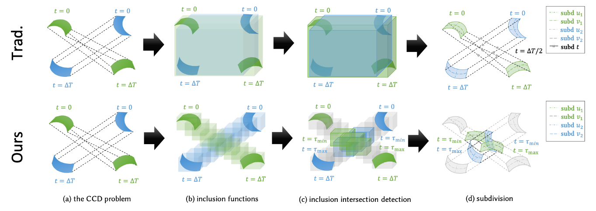
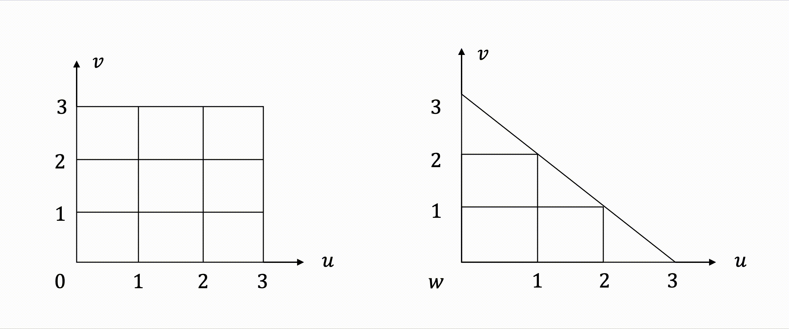

# TDIB-CCD
This is the official implementation of [A Time-Dependent Inclusion-Based Method for Continuous Collision Detection between Parametric Surfaces](https://xw-c.github.io/publication/siga24/) (accepted as SIGGRAPH Asia 2024 Journal Paper).



## Content
### Structure
We have provided the core code for CCD between parametric surfaces in the `./core` folder, including implementation of geometric primitives, CCD solvers, and some auxiliary functions. Different test scenarios are set in the `./scene` folder.

Also, we have provided a denegerate version of CCD methods for EE tests and VF tests between linear triangle meshes in the `./linear-tri` folder.

### CCD solver
We have implemented the traditional inclusion-based method (described in Section 3) in `./core/solverTrad.h` and our proposed time-dependent inclusion-based method (described in Section 4) in `./core/solverTD.h`. Both methods can adopt AABB or OBB as the inclusion type.

### Geometric primitives
CCD methods between parametric surfaces have been tested on different geometric primitives, including triangular patches and rectangular patches of 1st/2nd/3rd order. Each patch is represented by a list of control points. Taking third-order patches as an example, we illustrate the order below. 
- Each control point of an rectangular patch of order $n$ is denoted by 2 integers indicating its position on the $(u,v)$ grid.
- Each control point of an triangular patch of order $n$ is denoted by 3 integers, which add up to $n$, indicating its position on the $(u,v,w)$ grid.



### Test scenarios
This repository has contained 3 experiments for CCD between parametric surfaces.
- Singel test. We manually design a simple case to show how to use the CCD solver.
- Random test. It randomly generates a number of CCD cases between third-order rectangular patches and report the average time consumption. The geometric primitive can be changed by editing the template parameters in the `main` function.
- Bunny-torus test (Figure 2). CCD is applied between 2 multi-patch objects. Both the bunny and the torus undergo imitated rigid-body motions.

Also, it has contained 1 experiment for EE/VF tests.
【【【【【【TODO】】】】】】
## Usage
### Install
- Install [xmake](https://xmake.io/). 
- Run the following lines to install this project:
```
git clone https://github.com/xw-c/TDIB-CCD.git
cd TDIB-CCD
xmake
```
### Run experiments
```
xmake run scene
```
Optional arguments:
```
-s    Type of CCD solver. Use "trad" for the traditional method, or "td" for our time-dependent method.
-e    Type of experiment. Use "rand" for the random test, "single" for the single test, or "bunny" for the bunny-torus test.
-b    Type of inclusions. Use "aabb" for AABB, or "obb" for OBB.
-d    Precision requirement, i.e., maximum width of the parametric interval.
-k    Number of generated cases. Only used in the "rand" experiment.
```
The default setting is
```
xmake run scene -s td -e rand -b obb -d 1e-6 k 100
```
Put the `./scene/bunny292.obj` file under the same folder as `scene.exe` before you run the bunny-torus test.

To build the test for EE/VF tests, umcomment the last lines in `./xmake.lua` and run `xmake`. 
【【【【【【TODO】】】】】】

## Contact
Feel free to open a github issue or contact us at [pku_xwchen@163.com](mailto:pku_xwchen@163.com).

## Citation
Please consider citing our paper if you find it useful for your project :)
```
@article{10.1145/3687960,
author = {Chen, Xuwen and Yu, Cheng and Ni, Xingyu and Chu, Mengyu and Wang, Bin and Chen, Baoquan},
title = {A Time-Dependent Inclusion-Based Method for Continuous Collision Detection between Parametric Surfaces},
year = {2024},
issue_date = {December 2024},
publisher = {Association for Computing Machinery},
address = {New York, NY, USA},
volume = {43},
number = {6},
issn = {0730-0301},
url = {https://doi.org/10.1145/3687960},
doi = {10.1145/3687960},
journal = {ACM Trans. Graph.},
month = nov,
articleno = {223},
numpages = {11}
}
```